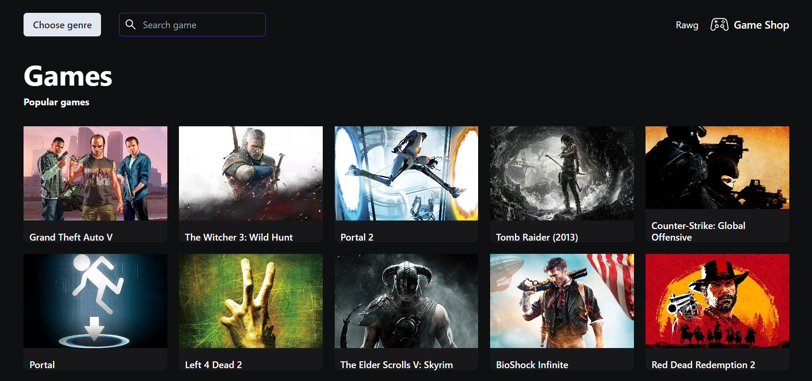

# Game shop

**You can also read this README in [English](https://github.com/klekwedge/game-shop/blob/main/README.EN.md).**

## Оглавление

- [Инструкции по развертыванию](#инструкции-по-развертыванию)
- [Обзор](#обзор)
  - [Скриншот](#скриншот)
  - [Ссылки](#ссылки)
- [Мой процесс](#мой-процесс)
  - [Стек](#стек)
  - [Что я узнал](#что-я-узнал)
- [Автор](#автор)

## Инструкции по развертыванию

**Для запуска проекта на вашем компьютере должны быть установлены [npm](https://nodejs.org/en/) и [git](https://git-scm.com/downloads)**

1. Сделайте клон этого репозитория ```git clone https://github.com/klekwedge/game-shop.git```
2. Установите все необходимые пакеты npm с помощью ```npm i```
3. Запустите проект командой ```npm run start```

## Обзор

### Скриншот



### Ссылки

- [Ссылка на проект](https://github.com/klekwedge/game-shop)
- [Деплой](https://klekwedge-game-shop.vercel.app/

## Мой процесс

### Стек

- React
- TypeScript
- Redux Toolkit
- React router
- Chakra UI
- Swiper
- React Icons
- React Helmet
- SCSS
- Tailwind

### Что я узнал

Сделал многостраничное приложение (SPA). Я научился отправлять запросы к API, получать ответ от сервера и обрабатывать его с помощью Redux Toolkit, а именно с помощью createAsyncThunk, отображать полученные данные на страницах. Я понял, как работает маршрутизация, используя React Router. Я лучше понял, как типизировать компоненты и как типизировать данные, полученные с сервера, как обновлять данные в хранилище и использовать слайсы Redux. Улучшено понимание создания и использования сервисов для отправки запросов и получения данных. Получил базовое понимание того, как работать с Tailwind.

## Автор

- [Вебсайт](https://klekwedge-cv.vercel.app/)
- [Linkedin](https://www.linkedin.com/in/klekwedge/)
- [Facebook](https://www.facebook.com/klekwedge)
